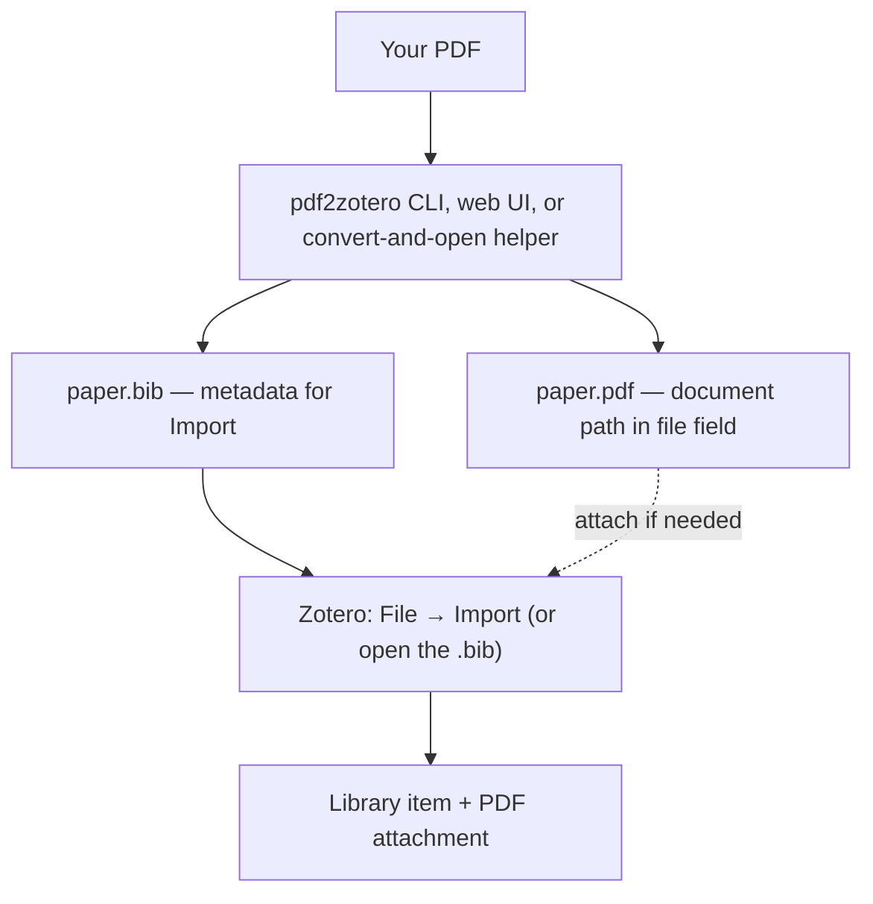
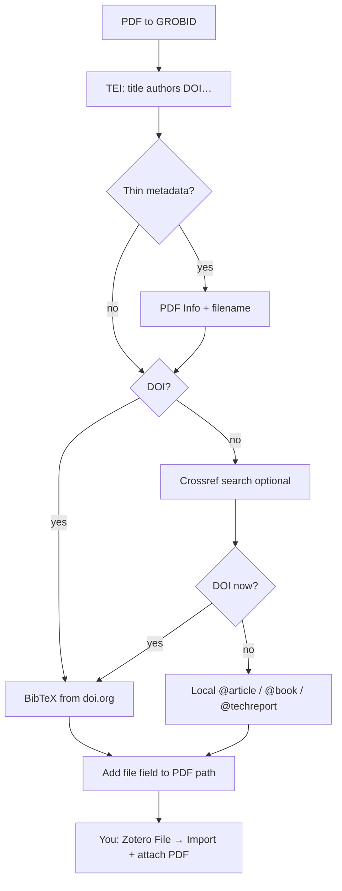

# Getting started — from zero to material in Zotero

This guide is for researchers and students who want to:

1. Take a **PDF** (article, book, or report) on their computer  
2. Build a good **bibliographic record**  
3. Get **both** into **Zotero** as a normal library item with the PDF attached  

You do **not** need to know Python packaging, Docker theory, or BibTeX syntax. You only need a terminal — **Terminal** on macOS, any shell on Linux, or **PowerShell** / [Windows Terminal](https://learn.microsoft.com/en-us/windows/terminal/) on Windows — and the Zotero desktop app.

**Zotero is the library.** This project only prepares files. All steps that put items and PDFs *into* Zotero follow Zotero’s own product documentation (linked below and again at each step).

### Official Zotero documentation (authoritative)

These pages are maintained by the Zotero project. Prefer them if anything here conflicts with Zotero’s UI in a newer version.

| Topic | Official page |
|-------|----------------|
| Documentation home | [zotero.org/support](https://www.zotero.org/support) |
| Download desktop app | [zotero.org/download](https://www.zotero.org/download/) |
| Import BibTeX / RIS / other formats | [Importing standardized formats](https://www.zotero.org/support/kb/importing_standardized_formats) |
| Add items (browser, identifier, PDFs, import) | [Adding items to Zotero](https://www.zotero.org/support/adding_items_to_zotero) |
| Attach PDFs (drag-and-drop, stored vs linked) | [Adding files to your Zotero library](https://www.zotero.org/support/attaching_files) |
| Retrieve metadata from a PDF | [Retrieve PDF metadata](https://www.zotero.org/support/retrieve_pdf_metadata) |
| Field mappings (import/export) | [Import/export field mappings](https://www.zotero.org/support/kb/field_mappings) |
| Moving from another reference manager | [Moving to Zotero](https://www.zotero.org/support/moving_to_zotero) |
| File sync (stored attachments) | [Sync](https://www.zotero.org/support/sync) |

---

## What “done” looks like

| Done | Not done |
|------|----------|
| Item appears in your Zotero library | Only a `.bib` file on disk |
| Title, authors, year (and preferably DOI) look right | Empty / “unknown” entry |
| PDF is listed under the item as an attachment | Metadata only, no document |



The **CLI and web UI** only prepare files. You import them with Zotero’s built-in **File → Import…** ([supported formats](https://www.zotero.org/support/kb/importing_standardized_formats)). On macOS, `scripts/import-to-zotero.sh` can convert and **open the `.bib` in Zotero**; on Windows, `scripts/import-to-zotero.ps1` does the same — still Zotero’s own import, not a private API.

---

## What you need (one-time)

**Install everything here first:** **[PREREQUISITES.md](PREREQUISITES.md)**  
(Python, Docker **or** Colima, GROBID, Zotero — step by step, including Apple Silicon / Colima tips and a full [Windows install order](PREREQUISITES.md#windows-install-order).)

| # | Software | Quick check (macOS/Linux) | Quick check (Windows) |
|---|----------|---------------------------|------------------------|
| 1 | Python 3.9+ (recommend 3.11–3.14) | `python3 --version` | `python --version` or `py -3 --version` |
| 2 | Docker Desktop **or** Colima + `docker` CLI | `docker info` | Docker Desktop + `docker info` (not Colima) |
| 3 | GROBID on port 8070 | `curl -s http://localhost:8070/api/isalive` | `curl.exe -s http://127.0.0.1:8070/api/isalive` |
| 4 | This repo | `ls pdf2zotero.py webui.py scripts/import-to-zotero.sh` | `Get-Item pdf2zotero.py, webui.py, scripts\import-to-zotero.ps1` |
| 5 | Zotero desktop | [download](https://www.zotero.org/download/) | same |
| 6 | Network (usual) | for doi.org / Crossref | same |

**You do not need:** third-party pip packages (runtime is stdlib-only; `requirements.txt` is empty), Crossref API key, Zotero API key, or LaTeX.

Short clone (details in PREREQUISITES):

```bash
git clone https://github.com/jensabrahamsson/pdf2zotero.git
cd pdf2zotero
chmod +x pdf2zotero.py webui.py scripts/import-to-zotero.sh
```

Windows (PowerShell; no `chmod` needed when calling `python …`):

```powershell
git clone https://github.com/jensabrahamsson/pdf2zotero.git
cd pdf2zotero
```

Optional PATH helper (macOS/Linux):

```bash
mkdir -p ~/bin
ln -sf "$(pwd)/pdf2zotero.py" ~/bin/pdf2zotero
# export PATH="$HOME/bin:$PATH"  # e.g. in ~/.zshrc
```

---

## Everyday use — choose CLI, web UI, or convert-and-open helper

CLI and web UI use the **same** conversion logic and end with **import into Zotero**. On macOS you can also run `scripts/import-to-zotero.sh`; on Windows, `scripts/import-to-zotero.ps1`. Both convert and open the `.bib` in Zotero.

### Path A — Command line (batch-friendly)

**Terminal 1:** GROBID running  
(`./scripts/setup-grobid.sh up` on macOS/Linux, or `.\scripts\setup-grobid.ps1 up` on Windows — see [PREREQUISITES](PREREQUISITES.md)).

**Terminal 2 (macOS / Linux):**

```bash
cd /path/to/pdf2zotero

# Single PDF (writes paper.bib next to the PDF)
python3 pdf2zotero.py "/path/to/paper.pdf"

# Or if you installed the symlink:
pdf2zotero "/path/to/paper.pdf"
```

**Terminal 2 (Windows PowerShell):**

```powershell
cd path\to\pdf2zotero

# On Windows, prefer python or py -3 (python3 may be missing)
python pdf2zotero.py "C:\Users\Ada\Documents\paper.pdf"
# or: py -3 pdf2zotero.py "C:\Users\Ada\Documents\paper.pdf"
```

Example output:

```text
/path/to/paper.pdf -> /path/to/paper.bib [DOI metadata (10.xxxx/...)]
```

or:

```text
… [GROBID/PDF fallback]
```

Open `paper.bib` in a text editor if you want: you should see `@article{…}`, `@book{…}`, or `@techreport{…}`, and usually a line like:

```bibtex
file = {:/path/to/paper.pdf:application/pdf}
```

That `file` line is how Zotero can find the **PDF itself** on import.

On macOS, a Finder folder whose name contains a slash (for example `Masteruppsatsen 26/27`) is stored with a **colon** in the POSIX path (`26:27`). Zotero’s BibTeX importer splits `file` on unescaped `:` and `;`, so pdf2zotero writes those characters as `\:` and `\;` (the path is not LaTeX-escaped). Example:

```bibtex
file = {:/Users/you/Papers/Masteruppsatsen 26\:27/paper.pdf:application/pdf}
```

On Windows the same field uses **forward slashes** and an **escaped drive colon** (unescaped `C:` is a JabRef delimiter):

```bibtex
file = {:C\:/Users/Ada/Documents/paper.pdf:application/pdf}
```

If import does not attach the PDF, drag it onto the parent item (Part B below) — that always works.

Several PDFs:

```bash
python3 pdf2zotero.py a.pdf b.pdf c.pdf
```

```powershell
python pdf2zotero.py a.pdf b.pdf c.pdf
```

### Path B — Web UI (drag and drop)

**Terminal 1:** GROBID running.

**Terminal 2:**

```bash
cd /path/to/pdf2zotero
python3 webui.py
```

Windows:

```powershell
cd path\to\pdf2zotero
python webui.py
```

Browser opens `http://127.0.0.1:8765/` (or open that URL yourself).

1. Status bar should say **GROBID is online** (green).  
2. Drag a PDF onto the page (or click to choose).  
3. Wait for the preview.  
4. Note the paths under **Saved PDF** / **Saved BibTeX**.  

By default files are written to:

```text
~/Downloads/pdf2zotero/
  Your Paper.pdf
  Your Paper.bib      ← this is what you import
```

On Windows that is typically `%USERPROFILE%\Downloads\pdf2zotero\` (same `Path.home() / "Downloads" / "pdf2zotero"` as on other platforms).

The web UI stays **local** (`127.0.0.1`). Your PDFs are not uploaded to a cloud service run by this project.

### Path C: macOS convert and open in Zotero

`scripts/import-to-zotero.sh` is a wrapper around the same CLI. It does **not** reimplement metadata logic. In order it:

1. Starts Docker Desktop or Colima if `docker info` fails  
2. Starts the GROBID container if `http://127.0.0.1:8070/api/isalive` is not true  
3. Opens the Zotero desktop app  
4. Runs `pdf2zotero.py` on each PDF (writes `name.bib` next to `name.pdf`)  
5. Opens each `.bib` with Zotero (`open -a Zotero file.bib`) — the same [File → Import](https://www.zotero.org/support/kb/importing_standardized_formats) path as Part A below  

macOS notifications show progress. There is no Zotero API key and no private import protocol.

```bash
chmod +x scripts/import-to-zotero.sh   # once
./scripts/import-to-zotero.sh "/path/to/paper.pdf"
./scripts/import-to-zotero.sh a.pdf b.pdf
./scripts/import-to-zotero.sh --install
```

`--install` writes a Finder Quick Action to `~/Library/Services/Importera till Zotero.workflow`. Then: select a PDF in Finder → right-click → **Quick Actions** → **Importera till Zotero**.

After import, still confirm the PDF is a **child attachment** (Part B). On Linux, use Path A or B and **File → Import…**.

### Path D: Windows convert and open in Zotero

`scripts/import-to-zotero.ps1` is the Windows counterpart of Path C. It does **not** reimplement metadata logic. In order it:

1. Starts Docker Desktop if `docker info` fails  
2. Starts GROBID via `setup-grobid.ps1` if `http://127.0.0.1:8070/api/isalive` is not true  
3. Opens the Zotero desktop app when `zotero.exe` is found  
4. Runs `pdf2zotero.py` on each PDF (writes `name.bib` next to `name.pdf`)  
5. Opens each `.bib` with Zotero — the same [File → Import](https://www.zotero.org/support/kb/importing_standardized_formats) path as Part A below  

```powershell
.\scripts\import-to-zotero.ps1 "C:\Users\Ada\Documents\paper.pdf"
.\scripts\import-to-zotero.ps1 a.pdf b.pdf
.\scripts\import-to-zotero.ps1 -Install
```

If execution policy blocks `.ps1` files:

```powershell
powershell -NoProfile -ExecutionPolicy Bypass -File .\scripts\import-to-zotero.ps1 paper.pdf
```

`-Install` writes a **Send to** shortcut (`Import to Zotero.lnk`) under the Windows SendTo folder. Then: right-click a PDF in File Explorer → **Show more options** → **Send to** → **Import to Zotero**.

After import, still confirm the PDF is a **child attachment** (Part B).

---

## Get the material into Zotero (exact 1–2–3… steps)

This is the part that puts **metadata and the PDF document** into your library.

The CLI and web UI do **not** push into Zotero by themselves. You use Zotero’s normal import and file tools (or Path C on macOS / Path D on Windows, which open the `.bib` in Zotero), documented by Zotero here:

| Official Zotero page | What it covers |
|----------------------|----------------|
| [Import BibTeX / standardized formats](https://www.zotero.org/support/kb/importing_standardized_formats) | **File → Import… → A file** for BibTeX (and other formats) |
| [Adding items to Zotero](https://www.zotero.org/support/adding_items_to_zotero) | Items vs files; importing databases; PDFs |
| [Adding files (PDFs)](https://www.zotero.org/support/attaching_files) | **Drag-and-drop** PDFs onto items; stored vs linked files |
| [Retrieve PDF metadata](https://www.zotero.org/support/retrieve_pdf_metadata) | Optional alternative: start from a PDF alone |

**Two different jobs:**

| Job | What you import | Zotero result |
|-----|-----------------|---------------|
| A. Bibliographic record | the `.bib` file | A **parent item** (book, article, …) |
| B. The document itself | the `.pdf` file | A **child attachment** under that item |

pdf2zotero prepares both files and puts a `file = {:…pdf…}` hint in the `.bib`.  
**You still complete A (always) and B (if the PDF did not appear automatically).**

---

### Part A — Import the bibliographic record (required)

Follows Zotero’s documented flow: *File → Import…* and choose *A file*  
([official instructions](https://www.zotero.org/support/kb/importing_standardized_formats)).

1. Open the **Zotero desktop app**.  
2. In the menu bar, click **File**.  
3. Click **Import…**.  
4. When Zotero asks what to import, choose **A file** (import a bibliographic file, not “a folder of PDFs” and not only clipboard text).  
5. In the file picker, go to the folder that contains your `.bib`:
   - **CLI:** same folder as the PDF (e.g. `…/Karen Barad_….bib`)  
   - **Web UI:** usually `~/Downloads/pdf2zotero/`  
6. Select the **`.bib`** file (not the `.pdf`).  
7. Click **Open** / **Import**.  
8. Accept the default import options unless you know you need something else.  
9. Finish the wizard.

**Check:** In the middle pane you should see a new **parent item** (e.g. a book by Barad) with title, authors, year, DOI if present.

That is **metadata only** until Part B succeeds.

---

### Part B — Attach the PDF document (required for “material in Zotero”)

Zotero’s own docs say you can add a local PDF by **dragging it onto an existing item** to create a **child attachment**  
([Adding PDFs and other files](https://www.zotero.org/support/adding_items_to_zotero#adding_pdfs_and_other_files),  
[Drag and drop](https://www.zotero.org/support/attaching_files#drag_and_drop)).

#### B1 — See if import already attached the PDF

1. Click the new parent item in Zotero’s middle pane.  
2. Look for a small triangle/arrow next to it (or expand the item).  
3. If you see a **PDF child** underneath, double-click it.  
4. If the PDF opens → **you are done** (Parts A + B complete).

If there is **no PDF child**, continue with B2. This is common: BibTeX import is for bibliographic data; the `file` field is not always turned into an attachment.

#### B2 — Attach the PDF by drag-and-drop (always works)

Per Zotero: *“Files dropped onto an existing regular Zotero item in the center pane are added as child items.”*  
([Attaching files — Drag and Drop](https://www.zotero.org/support/attaching_files#drag_and_drop))

1. Leave Zotero open with the **parent item selected** (or clearly visible in the middle pane).  
2. Open **Finder** (macOS), **File Explorer** (Windows), or your file manager (Linux).  
3. Go to the folder that holds the PDF:
   - CLI: original folder (e.g. Downloads)  
   - Web UI: `~/Downloads/pdf2zotero/` (on Windows, typically `%USERPROFILE%\Downloads\pdf2zotero\`)  
4. Find the **`.pdf`** file (same base name as the `.bib`).  
5. **Drag** the PDF from Finder / File Explorer.  
6. **Drop it onto the parent item** in Zotero’s middle pane (onto the book/article row, not into empty space between items).  
7. Wait a moment: a child attachment should appear under the item.

**Default behaviour (Zotero):** a **stored copy** of the file is created inside the Zotero data directory (recommended for sync).  
That is **not** the same as a mere link. See [Stored files vs linked files](https://www.zotero.org/support/attaching_files#stored_files_and_linked_files).

#### B3 — Alternative without drag-and-drop (same result)

Per Zotero’s attachment menu  
([Attachment menu](https://www.zotero.org/support/attaching_files#attachment_menu)):

1. Select the parent item.  
2. Click the paperclip **Add Attachment** button in the Zotero toolbar  
   (or right-click the item → **Add Attachment**).  
3. Choose **Attach Stored Copy of File…** (preferred)  
   or **Attach Link to File…** (advanced; does not sync like stored files).  
4. Select the PDF on disk.  
5. Confirm.

---

### Part C — Confirm you are finished

1. Expand the parent item.  
2. You should see:
   - the bibliographic item (title, author, …), **and**  
   - a PDF attachment underneath.  
3. Double-click the PDF attachment → document opens.  
4. Optional: put the item in a collection, add tags, cite it — normal Zotero use  
   ([Adding items](https://www.zotero.org/support/adding_items_to_zotero)).

**Success checklist**

| # | Check |
|---|--------|
| 1 | Parent item exists (from `.bib` import) |
| 2 | PDF is a **child** of that item (not a loose standalone PDF with no parent) |
| 3 | Double-click opens the correct document |

If the PDF is **standalone** (no parent metadata), Zotero recommends turning it into a child under a proper item — drag it onto the parent, or use Create Parent Item  
([Child vs standalone](https://www.zotero.org/support/attaching_files#child_versus_standalone_attachment_files)).

---

### Optional paths (only if you prefer)

**PDF first, then metadata** ([Zotero on local PDFs](https://www.zotero.org/support/adding_items_to_zotero#adding_pdfs_and_other_files)):

1. Drag the PDF into Zotero (standalone attachment).  
2. Right-click → **Create Parent Item** → enter DOI/ISBN, **or** import the `.bib` and drag the standalone PDF onto that parent.  
3. Or right-click PDF → retrieve metadata if Zotero offers it ([Retrieve PDF metadata](https://www.zotero.org/support/retrieve_pdf_metadata)).

For books/reports, **pdf2zotero → import `.bib` → attach PDF (Part B2)** is usually more reliable than Retrieve Metadata alone.

---

## What happens under the hood (short)

You do not need this to use the tool; it helps when something fails.



- **Articles** often get a DOI from GROBID.  
- **Books / reports** often need PDF Info + Crossref.  
- Offline: `--no-doi-lookup` or the web UI checkbox skips doi.org/Crossref only (not remote GROBID).

More detail: [GUIDE.md](GUIDE.md).

---

## Worked examples

### Example 1 — Journal PDF via CLI

```bash
# GROBID already running
python3 pdf2zotero.py ~/Papers/smith2020.pdf
# → ~/Papers/smith2020.bib
```

Windows:

```powershell
python pdf2zotero.py "$env:USERPROFILE\Documents\smith2020.pdf"
```

Zotero: **File → Import…** → `smith2020.bib` → check PDF attachment → drag PDF onto item if needed.

### Example 2 — Book via web UI

```bash
python3 webui.py
# drop "Karen Barad_2007_Meeting….pdf"
# files appear in ~/Downloads/pdf2zotero/
```

```powershell
python webui.py
```

Zotero: import the new `.bib` from that folder → verify `@book` fields → attach PDF if missing.

### Example 3 — Offline flight

```bash
python3 pdf2zotero.py report.pdf --no-doi-lookup
```

```powershell
python pdf2zotero.py report.pdf --no-doi-lookup
```

Uses GROBID + PDF Info only. Import into Zotero the same way; fix metadata in Zotero later if needed.

### Example 4 — macOS helper (convert + open in Zotero)

```bash
./scripts/import-to-zotero.sh ~/Papers/smith2020.pdf
# optional once: ./scripts/import-to-zotero.sh --install
```

Zotero should open on `smith2020.bib`. Expand the new item and check the PDF child; drag the PDF onto the item if it is missing.

### Example 5 — Windows helper (convert + open in Zotero)

```powershell
.\scripts\import-to-zotero.ps1 "$env:USERPROFILE\Documents\smith2020.pdf"
# optional once: .\scripts\import-to-zotero.ps1 -Install
```

Zotero should open on `smith2020.bib`. Expand the new item and check the PDF child; drag the PDF onto the item if it is missing.

---

## Checklist before you ask “why is it empty?”

- [ ] `curl -s http://localhost:8070/api/isalive` works (Windows: `curl.exe -s http://127.0.0.1:8070/api/isalive`)  
- [ ] You ran pdf2zotero/web UI **after** GROBID was up  
- [ ] The `.bib` is not full of only `unknown` / almost empty (open it in a text editor)  
- [ ] You used **File → Import… → A file**, or Path C/D opened the `.bib` in Zotero — not “add PDF alone without import”  
- [ ] PDF path in the `.bib` still exists, **or** you dragged the PDF onto the item  
- [ ] Same computer (absolute paths do not work across machines)  
- [ ] On Windows, `file = {:C\:/…:application/pdf}` uses forward slashes and an escaped drive colon (expected)

---

## Troubleshooting

| Symptom | What to do |
|---------|------------|
| `Could not contact GROBID` | Start Docker + GROBID; wait for isalive; check `--grobid-url` |
| Web UI: GROBID offline | Same; status bar polls `/api/isalive` |
| `.bib` is tiny / `unknown…` | GROBID got little; try better PDF (text layer); check PDF Info; ensure network for Crossref |
| Import works, **no PDF** | Drag PDF onto the Zotero item (Part B). If a folder name contained `/` (macOS POSIX `:`), re-convert so `file` contains `\:`. On Windows, confirm the field looks like `{:C\:/…:application/pdf}` |
| `Ingen PDF-fil angiven` / `no PDF file given` | Pass one or more `.pdf` paths to `import-to-zotero.sh` / `import-to-zotero.ps1`, or `--install` / `-Install` |
| Finder Quick Action missing | `./scripts/import-to-zotero.sh --install`, then right-click a PDF → Quick Actions |
| Send to shortcut missing (Windows) | `.\scripts\import-to-zotero.ps1 -Install`, then right-click a PDF → Send to |
| Script waits on Docker / GROBID | Start Docker Desktop or Colima; see [PREREQUISITES.md](PREREQUISITES.md) |
| PDF opens on wrong machine | Paths are absolute and local — import on the machine that has the files |
| Port 8765 in use | `python3 webui.py --port 8766` (Windows: `python webui.py --port 8766`) |
| Docker / ARM issues | See README troubleshooting; try CRF image or Docker Desktop fully started |
| Windows: `python3` not found | Use `python` or `py -3` ([PREREQUISITES — Windows](PREREQUISITES.md#windows-install-order)) |
| Windows: cannot run `.ps1` | `powershell -NoProfile -ExecutionPolicy Bypass -File .\scripts\setup-grobid.ps1 up` |
| Windows: GROBID at `localhost` fails | `python pdf2zotero.py paper.pdf --grobid-url http://127.0.0.1:8070` |

---

## Next reading

| Doc | For |
|-----|-----|
| [PREREQUISITES.md](PREREQUISITES.md) | Python, Docker/Colima, GROBID, Zotero install (incl. [Windows](PREREQUISITES.md#windows-install-order)) |
| [README.md](README.md) | Overview, all CLI/web flags, license |
| [GUIDE.md](GUIDE.md) | Why the architecture is split; design diagrams |
| [Official Zotero documentation](#official-zotero-documentation-authoritative) | Zotero’s own manuals (import, attach, sync) — **source of truth for Zotero UI** |

---

## One-page cheat sheet

```bash
# 1) Once per session: GROBID
docker run --rm --init --ulimit core=0 -p 8070:8070 grobid/grobid:0.9.0-crf

# 2) Convert (pick one)
python3 pdf2zotero.py paper.pdf
# or
python3 webui.py          # then drop the PDF
# or (macOS: convert + open .bib in Zotero)
./scripts/import-to-zotero.sh paper.pdf
# ./scripts/import-to-zotero.sh --install   # Finder Quick Action
```

Windows (PowerShell):

```powershell
# 1) GROBID
.\scripts\setup-grobid.ps1 up

# 2) Convert (pick one)
python pdf2zotero.py paper.pdf
# or
python webui.py
# or (convert + open .bib in Zotero)
.\scripts\import-to-zotero.ps1 paper.pdf
# .\scripts\import-to-zotero.ps1 -Install   # Send to shortcut
```

**3–9) In Zotero — bibliographic record**  
([Zotero: import formats](https://www.zotero.org/support/kb/importing_standardized_formats))

1. Open Zotero  
2. **File → Import…**  
3. **A file**  
4. Select `paper.bib`  
5. Finish import  

**10–14) In Zotero — the PDF document**  
([Zotero: attach files by drag-and-drop](https://www.zotero.org/support/attaching_files#drag_and_drop))

1. Select the new parent item  
2. If a PDF child is already there → done  
3. Else: Finder / File Explorer → drag `paper.pdf`  
4. Drop **onto** the parent item  
5. Expand item → double-click PDF to verify  

**Success = parent item + PDF child attachment.**
