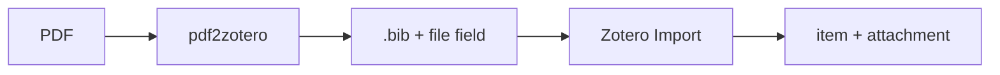
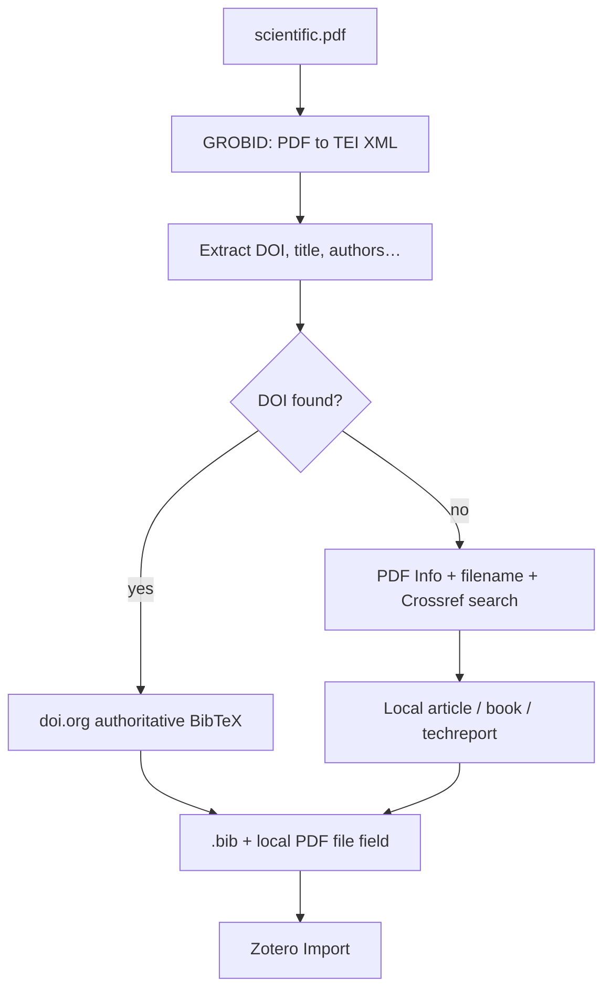
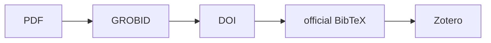
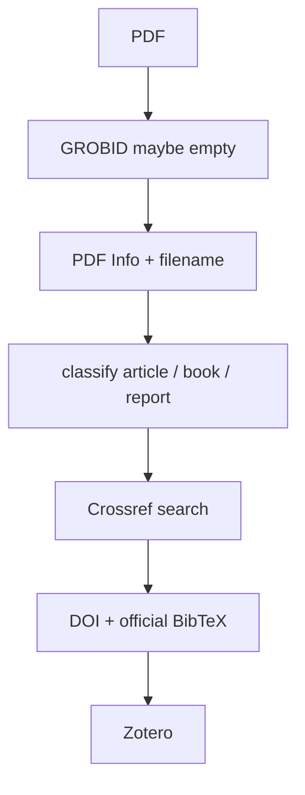
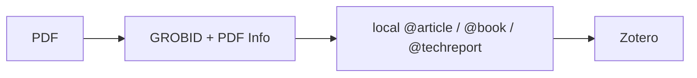
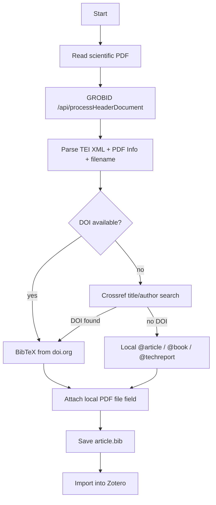
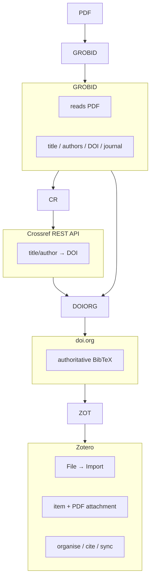
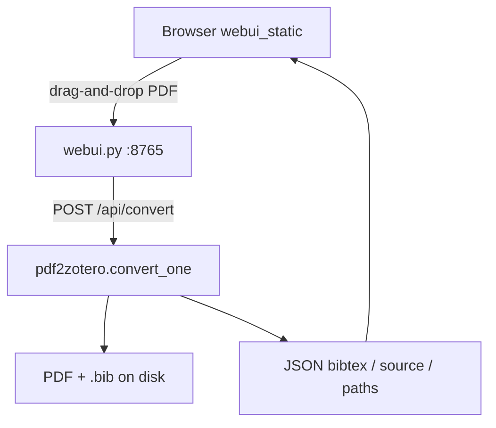

# Guide: architecture and design

## Start here if you want to *use* the tool

1. **[PREREQUISITES.md](PREREQUISITES.md)** — Python, Docker **or** Colima, GROBID, Zotero  
2. **[GETTING_STARTED.md](GETTING_STARTED.md)** — convert PDFs, import into Zotero, attach the PDF  

This GUIDE explains **why** the system is built this way and how the pieces fit together.

### Short reminder: usage

```bash
# Session: GROBID (pinned official image)
docker run --rm --init --ulimit core=0 -p 8070:8070 grobid/grobid:0.9.0-crf

# Convert (CLI)
python3 pdf2zotero.py paper.pdf          # → paper.bib (+ file path to PDF)

# or convert (web UI)
python3 webui.py                         # drop PDF → ~/Downloads/pdf2zotero/

# Zotero
# File → Import… → A file → the .bib
# If no PDF under the item: drag the PDF onto the item
```



How the **document itself** gets into Zotero:

1. **File → Import… → A file → `.bib`** creates the parent item  
   ([Zotero: importing formats](https://www.zotero.org/support/kb/importing_standardized_formats)).  
2. The `.bib` is **not** the PDF. If no child PDF appears, **drag the PDF onto the parent item**  
   ([Zotero: attaching files / drag-and-drop](https://www.zotero.org/support/attaching_files#drag_and_drop)).  

Exact 1–2–3… UI path:  
[GETTING_STARTED.md → Get the material into Zotero](GETTING_STARTED.md#get-the-material-into-zotero-exact-123-steps).

---

This document explains **why** pdf2zotero is built the way it is, and how the pieces fit together.

## Purpose

The product goal is:

> **Get this PDF into Zotero as a real library item** (metadata + document), not merely “extract some fields.”

Under that, separate technical problems:

1. **Understand the PDF** — GROBID’s job  
2. **Fetch the best bibliographic record** — DOI / Crossref’s job  
3. **Hand the result to Zotero** — BibTeX (or another [import format Zotero supports](https://www.zotero.org/support/kb/importing_standardized_formats)) via **File → Import…**

That is the same principle many modern reference managers use. This project does not reimplement a PDF parser, a metadata registry, or Zotero itself. It is a small integration layer so material **lands in the library**.

### The gap in research practice

The pain is rarely “I have no reference manager.” It is: *I already have the PDFs; they are not really **in** Zotero yet as trustworthy items with attachments.* Zotero can retrieve metadata for many articles; GROBID can parse layout; Crossref holds official records—but the path from a mixed pile of **articles, books, and reports** on disk to **imported library items** is still awkward, especially for grey literature and monographs.

pdf2zotero fills that **library-intake** gap as open, local glue rather than another closed platform. User-facing framing: [README → Why this exists](README.md#why-this-exists) and [Into Zotero](README.md#into-zotero-the-actual-goal).

## High-level pipeline



## Why not only GROBID?

GROBID is extremely good at reading **journal articles**. It can still misinterpret authors, pages, journal, or volume — and for **books / monographs** the header models often return almost nothing (empty TEI), even when the PDF Info dictionary has a perfect title and author.

If a work has a DOI, an **official** bibliographic record is already registered. Preferring that record is more reliable than trusting a one-shot parse.

Preferred path:



Book / report / thin-metadata path:



Last-resort fallback (no network / no match):



Reports are detected from title/filename cues such as *report*, *rapport*, *working paper*,
*technical report*, *white paper*, *utredning*, etc., and from Crossref work types
`report` / `report-series`.

## Decision flow



## What each system owns



Zotero is not a passive “viewer of metadata.” It is the **destination**: collections, citing, sync. pdf2zotero stops at a clean import file; Zotero owns everything after **Import**.

## Why this architecture is intentional

Each component does what it is best at:

| System | Strength |
|--------|----------|
| **GROBID** | PDF layout and header parsing → structured TEI |
| **DOI / Crossref** | Authoritative bibliographic metadata |
| **BibTeX file** | Zotero-supported import carrier ([formats list](https://www.zotero.org/support/kb/importing_standardized_formats)) |
| **Zotero** | Library, attachments, cite, sync — the place material lives |
| **CLI / web UI** | Local ways to produce the import file |

pdf2zotero is only the glue:

- call GROBID  
- extract identifiers and fallback fields  
- resolve DOI → BibTeX when possible  
- link the local PDF for Zotero attachment on import  
- expose that pipeline via **CLI** (`pdf2zotero.py`) or **local web UI** (`webui.py`)

That keeps the solution small, easy to reason about, and robust when a PDF is hard to parse: a correct DOI still yields a clean **library** entry after import—not just a JSON blob of fields.

## Prerequisites (runtime stack)

The architecture assumes these are available at runtime.  
**Full install steps:** **[PREREQUISITES.md](PREREQUISITES.md)** (Python, Docker/Colima, GROBID, Zotero).

| Layer | Prerequisite | Failure mode if missing |
|-------|----------------|-------------------------|
| Runtime | Python **3.9+** (recommend **3.11–3.14**; shebang `python3`; Windows: `python` / `py -3`) | Script does not start |
| Executable | `chmod +x pdf2zotero.py` (optional `~/bin/pdf2zotero` symlink; Windows invokes `python pdf2zotero.py`) | `Permission denied` / `command not found` |
| PDF understanding | GROBID HTTP API | Hard error: cannot process PDF |
| Hosting GROBID | Docker (or other GROBID install); Windows: Docker Desktop + `scripts/setup-grobid.ps1` | Same as above if nothing listens on the URL |
| Authoritative metadata | HTTPS to **doi.org** (BibTeX) and **Crossref** (DOI search) | Warning + fallback to local BibTeX |
| Library UI | Zotero (optional for generation) | You still get `.bib`; no in-app library |

End-user paths:

- CLI: `pdf2zotero artikel.pdf` → `artikel.bib` → Zotero **File → Import…**  
- Web: `python3 webui.py` → drop PDF → `~/Downloads/pdf2zotero/*.bib` → Zotero **File → Import…**

The script never ships GROBID or Zotero; it only talks to GROBID over HTTP and optionally to doi.org / Crossref.

## Implementation notes

- **GROBID endpoint:** `POST /api/processHeaderDocument` (header only; enough for DOI and core fields, faster than full-text processing).  
- **Crossref search:** `GET https://api.crossref.org/v1/works` when GROBID yields no DOI (title/author).  
- **DOI BibTeX:** HTTP GET to `https://doi.org/{doi}` with `Accept: application/x-bibtex`.  
- **PDF attachment:** JabRef/Zotero-style field  
  `file = {:/absolute/path/to/paper.pdf:application/pdf}`  
  always added (including when DOI metadata is used).  
  Paths are written with **POSIX separators** (`Path.resolve().as_posix()`) so Windows backslashes never hit BibTeX escaping; on Windows the value looks like  
  `file = {:C:/Users/…/paper.pdf:application/pdf}`.  
  If import does not attach the PDF, drag it onto the parent item  
  ([attaching files](https://www.zotero.org/support/attaching_files)).  
- **Offline / privacy:** `--no-doi-lookup` skips **doi.org and Crossref only**. It does **not** stop a configured remote GROBID URL from receiving the PDF.  
- **Debugging:** `--save-tei` writes GROBID’s TEI XML next to the `.bib` file (CLI).  
- **Resources:** Local GROBID is the heavy dependency (container image + RAM); the Python tools themselves are trivial.

### Web UI architecture



| Piece | Role |
|-------|------|
| `webui.py` | Local HTTP server, multipart upload, health check |
| `webui_static/` | UI only (HTML/CSS/JS) — no metadata logic |
| `pdf2zotero.py` | Sole conversion / Crossref / BibTeX implementation |

Design constraints:

- **Stdlib only** (no Flask/FastAPI).  
- **Localhost by default** — not a multi-user web service.  
- Uploaded files are **copied** into `--output-dir` so the `file` field is stable.  
- GROBID status is polled via `GET /api/health` (proxies GROBID `/api/isalive`).

## Zotero import checklist

Success = the work is **in the library** as a **parent item + PDF child**, not only that a `.bib` exists.

1. Produce `.bib` (and know where the PDF is on disk).  
2. Zotero: **File → Import… → A file → `.bib`**  
   ([docs](https://www.zotero.org/support/kb/importing_standardized_formats)).  
3. Confirm parent metadata.  
4. If no PDF child: drag PDF onto the item  
   ([docs](https://www.zotero.org/support/attaching_files#drag_and_drop))  
   or **Add Attachment → Attach Stored Copy of File…**.  
5. Expand item → double-click PDF.  
6. Optional: collections/tags ([adding items](https://www.zotero.org/support/adding_items_to_zotero)).

Numbered walkthrough: [GETTING_STARTED.md](GETTING_STARTED.md#get-the-material-into-zotero-exact-123-steps).

## Official Zotero documentation

Zotero’s product behaviour is defined by the Zotero project, not by this repo. Primary references:

| Official page | Relevance to pdf2zotero |
|---------------|-------------------------|
| [zotero.org/support](https://www.zotero.org/support) | Documentation hub |
| [Importing standardized formats](https://www.zotero.org/support/kb/importing_standardized_formats) | Why we emit BibTeX; **File → Import… → A file** |
| [Adding items to Zotero](https://www.zotero.org/support/adding_items_to_zotero) | Parent items vs PDFs; large-scale BibTeX/RIS import |
| [Adding files](https://www.zotero.org/support/attaching_files) | How the **PDF document** becomes a child attachment |
| [Retrieve PDF metadata](https://www.zotero.org/support/retrieve_pdf_metadata) | Alternate intake path (PDF-first) |
| [Field mappings](https://www.zotero.org/support/kb/field_mappings) | What survives import/export (attachments vs metadata) |
| [Moving to Zotero](https://www.zotero.org/support/moving_to_zotero) | Broader migration context |

User-facing steps that cite these pages: [GETTING_STARTED.md](GETTING_STARTED.md#official-zotero-documentation-authoritative).

## Related files

- [`PREREQUISITES.md`](PREREQUISITES.md) — **Python, Docker/Colima, GROBID, Zotero**  
- [`GETTING_STARTED.md`](GETTING_STARTED.md) — convert and import into Zotero  
- [`pdf2zotero.py`](pdf2zotero.py) — CLI + conversion library  
- [`webui.py`](webui.py) — local drag-and-drop web server  
- [`webui_static/`](webui_static/) — browser UI assets  
- [`README.md`](README.md) — overview and flag reference  
- [`AGENTS.md`](AGENTS.md) — conventions for automated agents  
