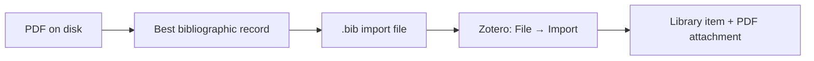
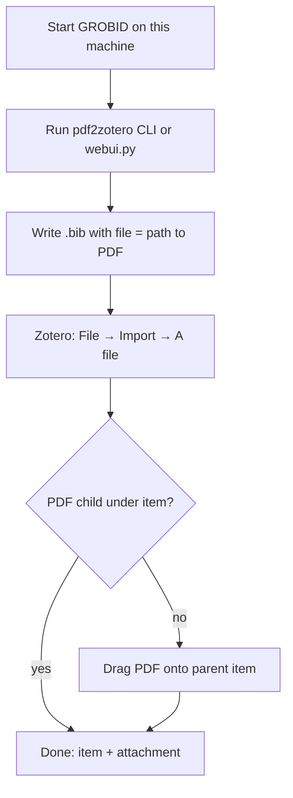
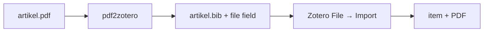
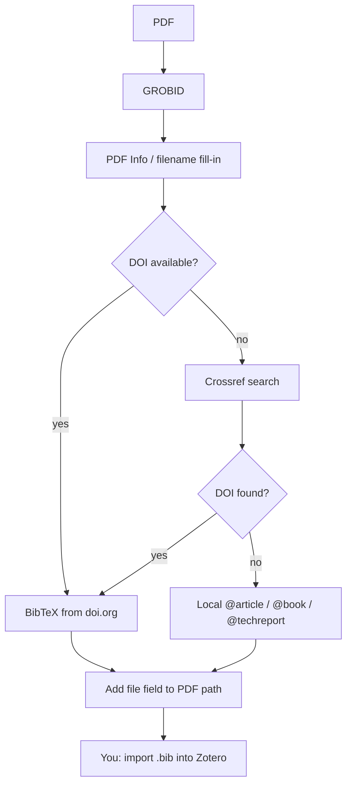

# pdf2zotero

**Get scholarly PDFs into Zotero** — as proper library items with metadata *and* the file attached.

> **New here?**  
> 1. **[PREREQUISITES.md](PREREQUISITES.md)** — Python, Docker/Colima, GROBID, Zotero  
> 2. **[GETTING_STARTED.md](GETTING_STARTED.md)** — convert → import into Zotero → attach PDF  

Metadata extraction is only a step. The goal is the Zotero library:



| Component | Role |
|-----------|------|
| **GROBID** | Understand the PDF (structure, DOI, title, authors, …) |
| **DOI / Crossref** (via doi.org) | Authoritative bibliographic record |
| **Zotero** | Where the material ends up (library, collections, citing) |

Parse the PDF and look up the best metadata are two different problems; **landing in Zotero** is the product.

| Doc | Contents |
|-----|----------|
| **[PREREQUISITES.md](PREREQUISITES.md)** | Python, Docker **or** Colima, GROBID, Zotero — install in order |
| **[GETTING_STARTED.md](GETTING_STARTED.md)** | Convert PDFs and import into Zotero (after prerequisites) |
| **[GUIDE.md](GUIDE.md)** | Architecture, design rationale, diagrams |
| **[e2e/README.md](e2e/README.md)** | Open-access corpus + batch e2e harness (hundreds of PDFs) |
| **[AGENTS.md](AGENTS.md)** | Conventions for AI coding agents |

### Official Zotero documentation

pdf2zotero does not redefine how Zotero works. For import and PDF attachments, follow Zotero’s manuals:

| Official Zotero page | Use when |
|----------------------|----------|
| [Support / documentation home](https://www.zotero.org/support) | Finding any Zotero topic |
| [Importing standardized formats](https://www.zotero.org/support/kb/importing_standardized_formats) | **File → Import… → A file** (BibTeX, RIS, …) |
| [Adding items to Zotero](https://www.zotero.org/support/adding_items_to_zotero) | Items, PDFs, bulk import from databases |
| [Adding files (attaching PDFs)](https://www.zotero.org/support/attaching_files) | Drag PDF onto an item; stored vs linked files |
| [Retrieve PDF metadata](https://www.zotero.org/support/retrieve_pdf_metadata) | Optional: start from a PDF alone |
| [Download Zotero](https://www.zotero.org/download/) | Install the desktop app |

Full step list with the same links: [GETTING_STARTED.md](GETTING_STARTED.md#official-zotero-documentation-authoritative).

## Why this exists

Researchers often sit on **folders of PDFs**—journal articles, books, technical reports, grey literature—and need them **in Zotero**: citable items, organised, with the PDF attached. Extracting title/author somewhere is not enough if the work never becomes a library record.

| Tool | Good at | Weak at |
|------|---------|---------|
| Zotero “Retrieve metadata” | Known DOIs, typical publisher PDFs | Books, reports, awkward scans, bulk folders |
| GROBID | Reading scholarly PDF layout | Official records *and* Zotero import |
| Crossref / doi.org | Authoritative metadata | Understanding *your* local file |
| Hand entry | Quality | Time |

Nothing open and small reliably does: *understand this PDF → fetch the best record → write a Zotero-importable file with the PDF linked → ready for File → Import*. That is the hole pdf2zotero aims at.

It does **not** replace Zotero, GROBID, or Crossref. It is glue so material **reaches your library**, especially monographs and reports where pure header parsing often fails.

## How it works (end-to-end)



**Success** = item in the library **and** PDF as attachment.  
A `.bib` file alone is only halfway.

Details and screenshots-in-words: [GETTING_STARTED.md](GETTING_STARTED.md).

## Quick start (if you already know the stack)

With GROBID already running on `http://localhost:8070`:

```bash
git clone https://github.com/jensabrahamsson/pdf2zotero.git
cd pdf2zotero
chmod +x pdf2zotero.py webui.py

# CLI
python3 pdf2zotero.py artikel.pdf
# → artikel.bib next to the PDF

# or web UI
python3 webui.py
# → http://127.0.0.1:8765/  (saves under ~/Downloads/pdf2zotero/)
```

Then in Zotero: **File → Import… → A file** → choose the `.bib`.  
If there is no PDF under the item, drag the PDF onto it.



### Optional PATH install

```bash
mkdir -p ~/bin
ln -sf "$(pwd)/pdf2zotero.py" ~/bin/pdf2zotero
# ensure ~/bin is on PATH, then:
pdf2zotero artikel.pdf
```

## Why this approach?

GROBID is excellent at reading PDFs, but it can still misread authors, pages, journal, or volume. If the article has a DOI, an official bibliographic record already exists.



Works for **articles, books, and reports**. Local fallbacks use `@article`, `@book`, or `@techreport` as appropriate.

## Prerequisites

**Full install instructions (Python, Docker or Colima, GROBID, Zotero):**  
→ **[PREREQUISITES.md](PREREQUISITES.md)**

| | Requirement |
|--|-------------|
| Python | 3.9+ floor (recommend 3.11–3.14; 3.9 is EOL) — `python3 --version` |
| Containers | Docker Desktop **or** Colima + Docker CLI |
| GROBID | e.g. `docker run --rm --init --ulimit core=0 -p 8070:8070 grobid/grobid:0.9.0-crf` then `curl -s http://localhost:8070/api/isalive` |
| Zotero | [Desktop app](https://www.zotero.org/download/) for library import |
| Network | doi.org + Crossref (optional with `--no-doi-lookup`; does not block remote GROBID) |

No runtime `pip install` for pdf2zotero (stdlib only). A `.venv` is fine for dev. See PREREQUISITES for install detail.

## Usage reference

### CLI

```bash
python3 pdf2zotero.py artikel.pdf
python3 pdf2zotero.py a.pdf b.pdf c.pdf
python3 pdf2zotero.py artikel.pdf -o refs.bib
python3 pdf2zotero.py artikel.pdf --no-doi-lookup
python3 pdf2zotero.py artikel.pdf --save-tei
python3 pdf2zotero.py artikel.pdf --grobid-url http://localhost:8070
python3 pdf2zotero.py artikel.pdf --timeout 180
```

| Option | Description |
|--------|-------------|
| `pdfs` | One or more PDF files |
| `-o`, `--output PATH` | Output `.bib` (single PDF only) |
| `--grobid-url URL` | GROBID base URL (default: `http://localhost:8070`) |
| `--timeout SEC` | Network timeout (default: `120`) |
| `--no-doi-lookup` | Do not contact doi.org/Crossref |
| `--save-tei` | Also save GROBID TEI XML beside the `.bib` |

Default: write `name.bib` next to `name.pdf`.

### Web UI

```bash
python3 webui.py
# http://127.0.0.1:8765/
```

| Option | Description |
|--------|-------------|
| `--host ADDR` | Default `127.0.0.1` |
| `--port N` | Default `8765` |
| `--grobid-url URL` | Default `http://localhost:8070` |
| `--timeout SEC` | Default `120` |
| `--output-dir PATH` | Default `~/Downloads/pdf2zotero` |
| `--no-doi-lookup` | Default offline mode for the UI (form may override) |
| `--no-browser` | Do not auto-open a tab |

**Browser:** drop zone, offline checkbox (initialized from `/api/health`), Download .bib, Copy, GROBID status.  
**Output:** PDF + `.bib` under `--output-dir` so `file` paths stay valid.

| Endpoint | Method | Description |
|----------|--------|-------------|
| `/` | GET | UI (self-only CSP; no third-party fonts) |
| `/api/health` | GET | GROBID alive, settings including `no_doi_lookup` default |
| `/api/convert` | POST | `file`; optional `no_doi_lookup` (`true`/`false`). **Missing field → server default** |

## Into Zotero (the actual goal)

pdf2zotero does **not** push into Zotero automatically. You finish with Zotero’s own UI, as documented by Zotero:

- [Import BibTeX / standardized formats](https://www.zotero.org/support/kb/importing_standardized_formats) — **File → Import… → A file**  
- [Adding items](https://www.zotero.org/support/adding_items_to_zotero) — items vs PDFs  
- [Attaching files](https://www.zotero.org/support/attaching_files) — drag PDF onto an item (child attachment)

### Why BibTeX?

Among Zotero’s import formats (BibTeX, BibLaTeX, RIS, CSL JSON, Zotero RDF, MODS, Endnote XML, …) we emit **BibTeX** because:

1. **File → Import… → A file** accepts it ([docs](https://www.zotero.org/support/kb/importing_standardized_formats))  
2. doi.org returns BibTeX via content negotiation  
3. We include `file = {:/abs/path:application/pdf}` as a *hint* for the PDF path  
4. Plain text — easy to inspect before import  

The `.bib` import creates the **parent item**. The **PDF** is a separate file attachment step if import did not attach it.

### Numbered steps (metadata + PDF)

**A — Bibliographic record (from `.bib`)**

1. Open Zotero.  
2. **File → Import…**  
3. Choose **A file**.  
4. Select the `.bib` produced by pdf2zotero.  
5. Finish import → parent item appears.

**B — Document (the PDF)**  
([Zotero: drag onto existing item](https://www.zotero.org/support/attaching_files#drag_and_drop))

6. Select the new parent item.  
7. If a PDF child is already listed under it → stop; you are done.  
8. Otherwise open Finder and locate the `.pdf`.  
9. Drag the PDF and **drop it onto the parent item** in Zotero’s middle pane.  
10. Expand the item and double-click the PDF to verify.

Or: select item → paperclip **Add Attachment** → **Attach Stored Copy of File…**  
([attachment menu](https://www.zotero.org/support/attaching_files#attachment_menu)).

Full click-path and success checklist:  
**[GETTING_STARTED.md → Get the material into Zotero](GETTING_STARTED.md#get-the-material-into-zotero-exact-123-steps)**.

## Limitations

- Scanned PDFs without a text layer often parse poorly in GROBID.  
- Crossref may mis-pick a work if the title is very generic — check the `.bib` before import.  
- BibTeX `file` import is not always honoured by every Zotero version/setting; dragging the PDF onto the item always works.  
- With no usable metadata the entry may be almost empty (still with a `file` field).  

## Troubleshooting

| Symptom | What to do |
|---------|------------|
| `Could not contact GROBID` | Start GROBID; wait; check `--grobid-url` |
| Web UI: GROBID offline | Same |
| `.bib` is tiny / `unknown…` | Bad parse; try text-layer PDF; ensure network for Crossref |
| Import OK, **no PDF** | Drag PDF onto the item in Zotero |
| `command not found: pdf2zotero` | Use `python3 pdf2zotero.py` or PATH symlink |
| Port 8765 in use | `python3 webui.py --port 8766` |
| Web UI will not open | `--no-browser` and open `http://127.0.0.1:8765/` manually |

Step-by-step recovery: [GETTING_STARTED.md → Troubleshooting](GETTING_STARTED.md#troubleshooting).

## License

Copyright (c) 2026 Jens Abrahamsson.  
[MIT License](LICENSE) — free to use, modify, and redistribute, with the copyright notice retained.

The CLI and web UI print this notice on startup / `--help`.

GROBID, doi.org, Crossref, and Zotero have their own terms; follow each project’s policy.
